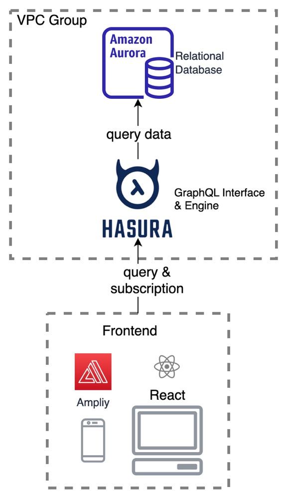
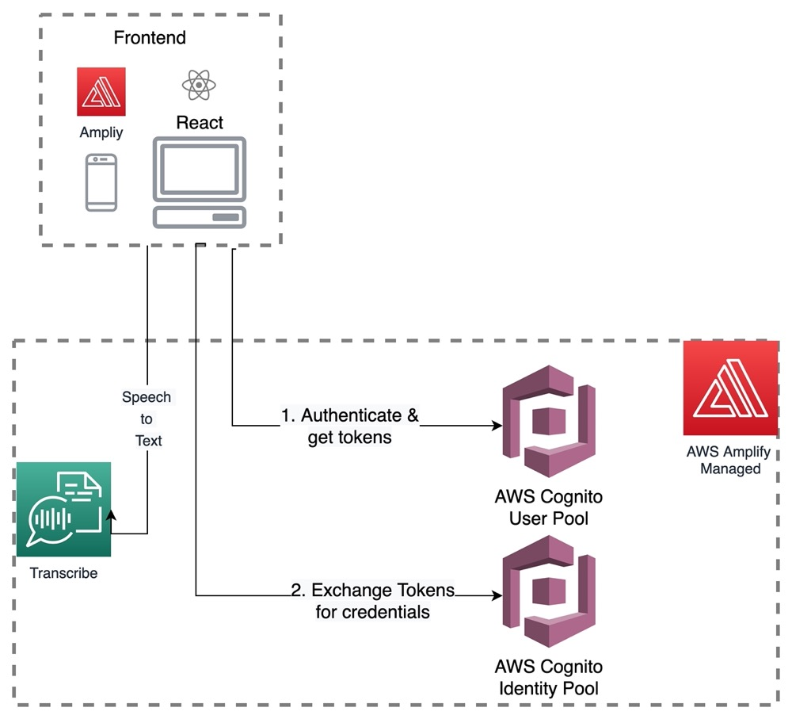
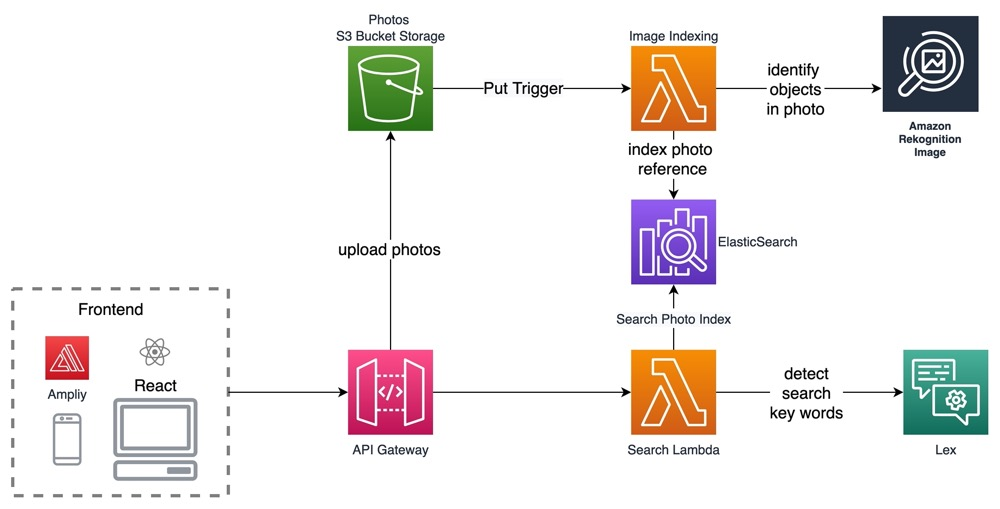

# cloud-computing-proj

## User Database
### Architecture

The user database uses AWS RDS Aurora Postgres as the database clusters, connected Hasura Cloud as GraphQL API Engine provider, since Most of the data query of this project is written in GraphQL and Hasura provides an easy and convenient interface to handle the API call in a scalable way.

All the relational tables are created, defined, and managed via Hasura Cloud, which modify the data to the actual instance on AWS RDS. 
the exact step of building Hasura Cloud with AWS RDS Aurora Postgres can be found here: https://hasura.io/docs/latest/graphql/cloud/getting-started/cloud-databases/aws-aurora/

## Authentication

User Authorization and Authentication uses Amazon Cognito managed by AWS Amplify

## Upload, Search, and Index Post

User Posts 

## Connect Wallet

## Data Pipeline

<b>Architecture</b>

The data pipeline uses Amazon MSK (Managed Streaming for Kafka) as the message queue, Flink as the stream computing platform, Redis as the processing results cache, and Spring Boot as the backend web service. The last three infrastructures are deployed in Amazon EC2. 

<b>Flink Execution Plan</b>

Flink uses Kafka as the data source and extracts the timestamp of each record, the mapped data will be sent to a sliding window with a window size of 3 hours and a window slide of 10 seconds. The operators then calculate the top ten most frequent labels in each window and sink them to Redis. 

The throughput for plain data is 2 GB per minute, but the performance of labeled data processing is limited due to the large ratio of our window size to slide size, so the processing speed is 10000 new labels per minute. Furthermore, by increasing the cluster size, this can be scaled linearly.

## Simulated Trading

