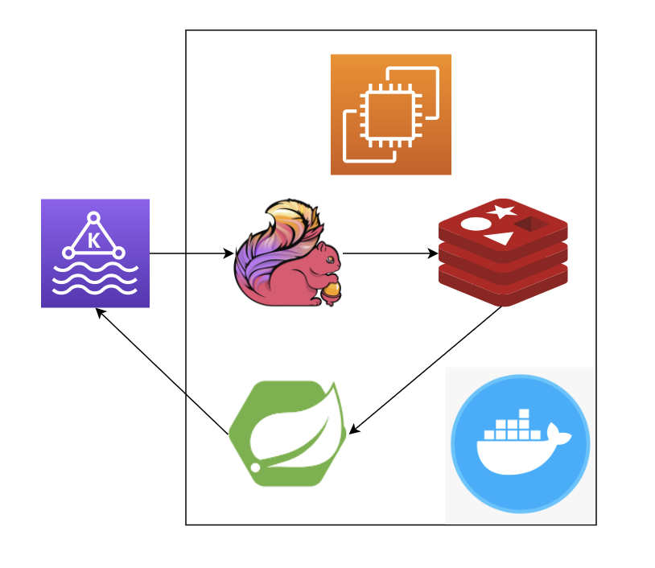

# cloud-computing-proj

## Data Pipeline
### Architecture

The data pipeline uses Amazon MSK (Managed Apache Kafka) as the message queue, Flink as the stream computing platform, Redis as the processing results cache, and Spring Boot as the backend web service. The last three infrastructures are deployed in Amazon EC2. 
### API
* `GET http://34.205.71.184:8080/api/etl/tag/{tag-name}`: add a new tag with `tag-name`.
* `GET http://34.205.71.184:8080/api/etl/top-tags`: get the top-10 tags (during the previous hour, update every ten seconds). 